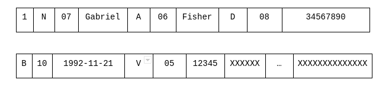
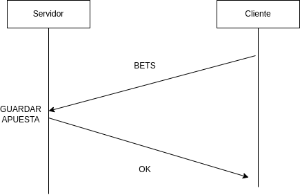
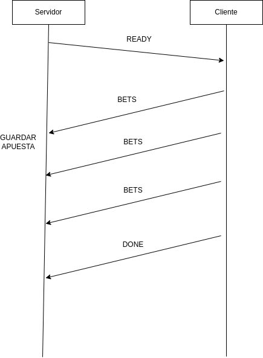
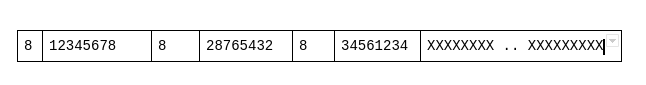
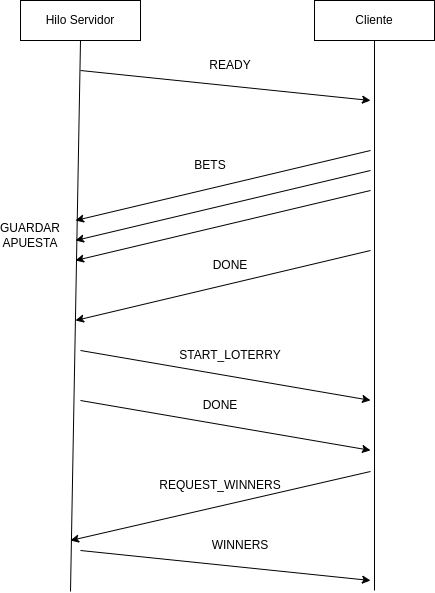

# TP0: Docker + Comunicaciones + Concurrencia

## Nombre: Alfonso Javier
## Apellido: Amezqueta
## Padron: 94732
## Materia: Sistemas Distribuidos, segundo cuatrimestre.

## Resolución

## Commits

Ejercicio 1 6543e2821c23e9470078828659e321213858f2d0 <br />
Ejercicio 1.1 e49fc7fb0a04f4a41963c0bdd6a846ec3b2e93e0<br />
Ejercicio 2 04c65ce0797b182b7c8d48f74aca85e9ae916763<br />
Ejercicio 3 9fa6cb988a992b7ee5c8df28d6a79c7970e62505<br />
Ejercicio 4 fbf8febefbf6417008d958b627d255272891492f<br />
Ejercicio 5 8d0c3b100e42159b083e97756c30f27737b09f68<br />
Ejercicio 6 ebc785392b6eb53f6c6418972111c8c5dad7682b<br />
Ejercicio 7 98da5df17fb556a145b0b33d07ff6dfea0754fc8<br />
Ejercicio 8 4e60faaeb4fb838a20cc19b117c164d141e5b7d7<br />

## Ejecución

Todos contenedores se ejecutan con:
```
make docker-compose-up
```

Para poder ver los logs de ejecución:
```
make docker-compose-logs
```

Por ultimo para detener y borrar los contenedores se ejecuta:
Todos contenedores se ejecutan con:
```
make docker-compose-down
```


## Ejercicio 1

Para este ejercicio se agregó otro contenedor llamado client2 en el archivo **docker-compose-dev.yaml**. Cuando se levantan los contenedores se crea un segundo cliente que interactúa con el EchoServer

## Ejercicio 1.1

Se agrego un archivo en Python llamado **docker-compose-maker.py**. Este archivo recibe un número entero N mayor a 0 y genera un docker compose con N clientes. Si recibe un número igual o menor a 0 o cualquier otro valor va a lanzar un error.

Para ejecutarlo se debe correr la siguiente linea:

```
python3 docker-compose-maker -n N
```

Donde N es el numero de clientes a crear

## Ejercicio 2

En el **docker-compose-dev.yaml** se agregaron volumes para vincular los archivos **config.yaml** y **config.ini** con sus respectivas copias en los contenedores correspondientes.

Para demostrarlo se puede levantar ambos contenedores y esperar a que el cliente finalice su ejecución. Luego se puede editar el archivo **config.yaml** y hacer que el puerto con el que se comunica el cliente es 12346 y luego hacer un **docker start client1** para levantar de vuelta al cliente. Se puede comprobar que el cliente ahora no se puede conectar con el servidor por lo que se verifica ahora se puede editar los archivos de configuración en los contenedores sin necesidad de buildear devuelta.


## Ejercicio 3

Se agregó un nuevo contenedor llamado **test-server**. Este contenedor esta conectado a la misma network que **server** y **client1**. **test-server** ejecutar un script **test-server.sh** que corre un bucle infinito. En cada ciclo consulta por si el servidor está caído, duerme 5 segundos y luego vuelve a consultar.

Para demostrarlo se puede levantar los 3 contenedores y comprobar que **test-server** indica que el server está levantado. Luego hacer un **docker stop server** y comprobar que el servidor está caído.

## Ejercicio 4

Tanto en el cliente como en el servidor se agregó para que capturen las señales SIGTERM y cierren de manera gracefully. Se puede comprobar haciendo **docker stop server (client1) -t 1**.

## Ejercicio 5

Se cambió el archivo de docker-compose para que levante 5 clientes, cada cliente representa una agencia de apuestas. En el docker-compose se le envían a los clientes variables de ambiente que corresponden a los datos que contienen las apuestas: nombre, apellido, documento, fecha de nacimiento y número. Cada cliente va a hacer una única apuesta en este caso.


La protocolo de comunicación entre servidor y cliente se desarrolla de la siguiente manera:


### Paso 1: El cliente genera un mensaje de apuestas y lo envía al servidor


El mensaje de apuesta entre el cliente y el servidor tiene el siguiente formato, dicho formato será usado en los ejercicios 5, 6 7 y 8 a partir de ahora.


Primero a cada uno de los datos correspondientes a las apuestas se les va a asignar un carácter.


A **Nombre** se le asigna el carácter **N** <br />
A **Apellido** se le asigna el carácter **A** <br />
A **Documento** se le asigna el carácter **D** <br />
A **Fecha de Nacimiento** se le asigna el carácter **B** <br />
A **Número** se le asigna el carácter **V** <br />


Cada mensaje que el servidor y el cliente se manden tendrá un tamaño de 1024 bytes (para este ejercicio).


El primer byte que envía el Cliente guarda un número correspondiente a la id de la agencia de apuestas.


Luego se guarda la información correspondiente a la apuesta de la siguiente forma:


(carácter identificado) + (longitud dato) + (dato)


Aclaró que la longitud del dato siempre se va a guardar en un string de longitud 2 por ejemplo si el nombre es **Gabriel** la longitud a guardar es 07, si el nombre es **Santiago Manuel** la longitud a guardar es 15.


Se almacena la información de la apuesta una después de otra y luego se agrega un padding al mensaje hasta completar los 1024 bytes.


Si yo tengo la apuesta para la agencia 1 hecha por Gabriel Fisher, DNI 34567890, 1992-11-21, 12345, entonces el mensajes que se le envía al servidor tiene la siguiente forma:





Si se van a mandar más de una apuesta entonces la información de estas se concatena una después de otra.


### Paso 2: El servidor recibe la apuesta, la procesa y le envia un mensaje a el cliente.


El servidor recibe el mensaje de algún cliente, lo guarda en el archivo bets.csv y envía un mensaje con la palabra **OK** al cliente con padding de letras "X" hasta formar un mensaje de 1024 bytes. Si el servidor tiene algún problema al realizar esta tarea envía un mensaje **ERROR** siguiendo el mismo formato


Una representación de protocolo se puede ver en la siguiente imagen:




## Ejercicio 6

Para este ejercicio y en adelante los clientes leen la información de las apuestas desde los archivos correspondientes y se envía el tamaño del batch de cada uno como variable de ambiente desde el **docker-compose.yaml**.


Todos los mensajes que se envían el cliente y el servidor tienen una longitud de 8KB, para todos los mensajes se agrega también un padding hasta completar la longitud requerida.


El protocolo usado para este ejercicio es el siguiente:


### Paso 1: El servidor espera por las conexiones:


El servidor espera tener 5 clientes conectados.


### Paso 2: El cliente envía la información de sus apuestas:


El servidor toma la primer cliente que se conecto y envía un mensaje de **READY**. El cliente para este momento ya leyó el archivo csv correspondiente. El cliente toma una cantidad de apuestas correspondientes al tamaño del batch escogido y arma el mensaje de apuestas descrito en el **Ejercicio 5**. Luego envía el mensaje al servidor el cual guardará las apuestas en el archivo bets.csv


El cliente continúa mandando mensajes de apuestas hasta que ya no tiene apuestas para mandar, una vez finalizado envía un mensaje de **DONE** al servidor.


El servidor pasa al siguiente cliente y repite el proceso.


Una representación de protocolo se puede ver en la siguiente imagen:




## Ejercicio 7

En este ejercicio se extiende el protocolo usado en el ejercicio 6 y se agregan dos nuevos pasos:


### Paso 3: El servidor realiza la lotería:


El servidor envía el mensaje START_LOTTERY a todos los clientes. Luego el servidor realiza la lotería y obtiene un resultado con los ganadores de las apuestas.


### Paso 4: El servidor informa a los ganadores de la loteria:


El servidor envía un mensaje READY al primer cliente al que se conectó. El cliente envía un mensaje REQUEST_WINNERS a el servidor el cual únicamente contiene la id de la agencia a la que pertenece el cliente. El servidor identifica al cliente y le manda un mensaje que contiene la lista de los Documentos los ganadores de la loteria.


El mensaje con los documentos correspondientes tiene la siguiente forma:


(largo del documento) + (documento)


Un ejemplo del mensaje sería el siguiente:





Una representación de protocolo se puede ver en la siguiente imagen:


## Ejercicio 8

Para resolver este ejercicio se crearon 5 hilos, uno por cada conexión con un cliente. Cada hilo hace **start()** en el momento en que se tienen las cinco conexiones. El protocolo de comunicación entre cada cliente y su correspondiente hilo sigue siendo el mismo que en el ejercicio 7:





Para manejar la concurrencia entre hilos se utiliza un mismo lock que se adquiere al momento de leer o escribir el archivo bets.csv. Cuando la operación sobre el archivo termina se libera lock.
